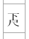
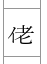
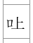

# Text Notation `kicksabc`

## Introduction

`kicksabc` is a text-based [kunkunshi](https://en.wikipedia.org/wiki/Kunkunshi) notation system.
The `kicks` program can import `kicksabc` through the GUI or render it directly to pdf from the command line.

    kicks --cli --to-pdf --output-dir=<output directory> <filename>.kicksabc

Inspired by [abc notation](https://abcnotation.com/) 
and [my friend's project](https://github.com/threedaymonk/kunkunshi). 

## General Format

Starts with a header, followed by a *single* blank line, followed by multiple note lines and lyric lines.

## Header

The header contains general information about the song.
Each line is headed by a command.

| Command | Meaning                | Values                          | Default if not present | Example               |
|---------|------------------------|---------------------------------|------------------------|-----------------------|
| `T`     | Title                  | String                          | Required command       | `T:安里屋ユンタ`      |
| `E`     | Romaji/English         | String                          | empty                  | `E:Asadoya Yunta`     |
| `K`     | Tuning                 | `honchoshi`, `sansage`, `niage` | `honchoshi`            | `K:honchoshi`         |
| `Q`     | Tempo in BPM           | Number                          | empty                  | `Q:120`               |
| `I`     | Processing Instruction | Various subcommands (see below) | (see below)            | `I:note-format kanji` |

Command `T`
: To put *furigana* (reading or ruby) beside kanji in the title use curly braces 
e.g. `{安里屋}{あさどや}ユンタ`
will render like this <ruby><rb>安里屋</rb><rt>あさどや</rt></ruby>ユンタ (but vertically!!)

Command `I`
: Instruction for how to process the `kicksabc` file.
Currently, there is only one subcommand (but more planned for future developments).

* `note-format <kanji|number>` (default is `number`) - 
Specifies whether the notes in the note lines are written as kunkunshi kanji or numbers.
See [Note lines](#note-lines).

## Note lines

Note lines are not preceded by a command and start after a blank line after the header.
Multiple note lines are allowed.
It expected that each phrase will be a separate line in the file as this will help with the alignment of lyrics.

The notes in a note line are separated by whitespace.

The notes can be specified in two different formats: kanji or number.

### Note Format Kanji

If the header contains the command

    I:note-format kanji

then notes are specified by kanji from the kunkunshi, e.g. 合, 四, 工, etc.
[Note modifiers](#note-modifiers) are added directly after the kanji.

The non-standard kanji that are used in kunkunshi are specified using two characters:
* a prefix of 下, イ(full-width katakana 'i') or ロ(full-width katakana 'ro')
* the kanji that makes up the rest of the character

E.g.

 is specified as 下尺

 is specified as イ老

 is specified as ロ上

### Note Format Number

If the header contains the command

    I:note-format number

or the note format instruction is not present then notes are specified by a 2-digit number.

The first digit is the string
- 1 = ūjiru
- 2 = nakajiru
- 3 = mījiru

and the second digit is position the finger is placed on the string.
- 0 = open string
- 1 = first finger position
- etc.

E.g. `10` = `合`, `21` = `上`, `33` = `七`

As a user creates more `kicksabc` the derivation of the numbers becomes unimportant 
and the numbers themselves become symbols for the notes, in the same way as the original kunkunshi.

### Note modifiers

Note modifiers come directly after the note number or kanji, in any order
e.g. `21^sf2` or `上^sf2` is `上` with upstroke, small size and finger 2.
Note modifiers are standard ASCII characters.

Note size
: `l` =  large, `s` = small (default: `l`. But `s` for notes on a cell boundary)

Accidental
: `b` = flat

Articulation
: `'` = hammer (uchi utu), `^` = upstroke (kaki utu)

Finger
: `f1`, `f2`, `f3`, `f4`

Slur
: `)` = slur to next note

Chord
: braces e.g. `{ 20 30 }` or `{ 四 工 }` (NOTE: brace must be surrounded by spaces - `{20 30}` is invalid)
  (NOTE: Absolute positioning of notes is not allowed for chords)

### Note position

By default, each note is set in the centre of a cell.

However, a note can be given an absolute position in the cell by adding the modifier `<n>`, 
where `n` is a number between 1 and 12.

E.g.

`21<6>` or `上<6>` would be `上` in the centre of the cell (default) (6/12)

`20<3>` or `四<3>` would be `四` one quarter of the way down the cell (3/12)

`22<12>` or `中<12>` would be `中` at the end of the cell (on the line). (12/12)
A shortcut for this is to precede the note with a full-stop `.`, e.g. `.20` = `20<12>` or `.四` = `四<12>`

### Repeats

Repeats
:      `[` = start repeat, `]` = end repeat

A start repeat is defaulted to a position relative to the note that follows
and an end repeat is positioned relative to the note that precedes it.
The absolute position can be controlled in the same way as for notes. E.g. `[<3>`

#### Repeat Modifiers

Repeat modifiers come directly after the repeat character, `[` or `]`.
e.g. `[C` is a start repeat with a filled circular head style.
Repeat modifiers are standard ASCII characters.

Head style
: `T` = triangle filled, `t` = triangle outline, `C` = circle filled, `c` = circle outline. 
  (default: `T`)

## Word lines

The syllables start their alignment with the notes in the note line preceding it.
To add a space use `*`.
The position of the syllable can be controlled in the same way as for notes.  E.g. `sa<3>` or `.sa`.

The syllables are written in romaji, which is converted to katakana.
Unknown values remain unchanged.

## Comments

Comments are a single line that starts with `%`.

## Example Scripts

1. Note Format Number

```
% This is an example of a kicksabc script
T:{安里屋}{あさどや}ユンタ
E:Asadoya Yunta
K:honchoshi

[ 22 30 33 10 33 10 33 33 31 30 20 21 22 30 10 30 10 31 30 00
20 10.20 21 10 21 22.21^ 10 30 10 11 20 22 21 12 20 00 ]

20 10.20 21 10 22 30 22 10.20 21 10 20 10.20 21 22 30 10 30 31 30 10
sa * ki * mi ha no na ka no i ba ra no ha * na * ka

30 10 31 10 31 10 30
sa * yu i<10> * yu i<10>

10 31 33 31 10.20 30 22 21 10.21 22 30 10 30 22 21 20 00
ku re te ka e re ba ya re ho ni hi ki to me ru

20 10.20 21 10 22 21 10 30 10s 11s 20 22 21 12 20 10 ]
ma ta ha * ri nu chi n da ra ka nu sha ma yo
```

2. Note Format Kanji

```
T:{安里屋}{あさどや}ユンタ
E:Asadoya Yunta
K:honchoshi
Q:120
I:note-format kanji

[　中　工　七　合　七　合　七　七　五　工　四　上　中　工　合　工　合　五　工　０
四　合.四　上　合　上　中.上^　合　工　合　乙　四　中　上　老　四　０　]

四　合.四　上　合　中　工　中　合.四　上　合　四　合.四　上　中　工　合　工　五　工　合
sa *     ki  *  mi ha  no na    ka no i  ba     ra no  ha *  na *   ka

工　合　五　　　　合　五　　　　合　工
sa *  yu i<10> *  yu i<10>

合　五　七　五　合.四　工　中　上　合.上　中　工　合　工　中　上　四　０
ku re te ka e     re ba ya re    ho ni hi ki to me ru

四　合.四　上　合　中　上　合　　工　合　乙　四　中　上　　老　四　合　]
ma ta    ha *  ri nu chi n  da ra ka nu sha ma yo

```
