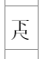
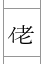
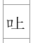

Notation
========

This document explains how the notation works.

Most of the characters used for the notes are standard kanji characters, such as 合　工　乙　etc. However, some of them use non-standard kanji characters.  These have to be created using multiple characters.

#### Vertical

 This is achieved by applying an affine transform to the font and scaling it to 100% width and 50% height.  The two characters are then drawn one above the other.

#### Horizontal

 This is achieved by using a half-width katakana 'イ' and drawing them side-by-side.

 As above but with half-width katakana 'ﾛ'.

